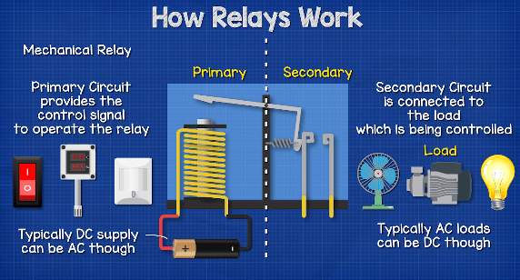
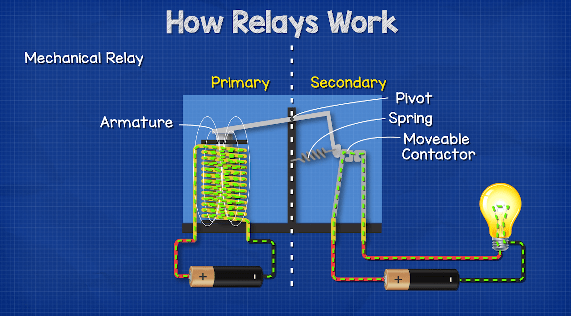

#KPIT #Assignment 

# List of Topics (Assignment)

- [x] **Relay**
- [x] **Darlington Transistor**
- [x] **Relay Driver ULN2803**
- [x] **Freewheeling diode**
- [x] **IO Expander**
- [x] **Serial Communication**
- [x] **I2C**
- [x] **I2C VS SPI**
- [x] **Relay Matrix**

# List of Topics

- **Relay**
- **Darlington Transistor**
- **Relay Driver ULN2803**
- **Freewheeling diode**
- **IO Expander**
- **Serial Communication**
- **I2C**
- **I2C VS SPI**
- **Relay Matrix**

## Relay
### What is Relay?
A relay is an electrically operated switch. Relays, traditionally, use an electromagnet to mechanically operate the switch. However, newer version will use electronics such as **solid-state relays (SSR)**.

### Main Parts of a Relay

**_Primary Circuit:_** The Primary circuit provides the control signal to operate the relay. This could be controlled by manual switch, a thermostat or some type of sensor. The primary circuit is generally connected to a low voltage DC supply.

**_Secondary Circuit:_** the secondary circuit is the circuit that contains the load which needs to be switched and controlled.

### How an Electromechanical Relay Works?

When the electromagnet energise it attracts the armature. When the electromagnet is deenrgised, the armature returns to its original position.
Connected to the armature  is a moveable contactor. When the armature is attracted to the electromagnet, it closes and completes the circuit on the secondary circuit side.

### How a Solid State Relay Works (SSR)?
**SSR** replace an electromagnetic filed with an LED light on the primary circuit side. The LED provides optical coupling by shining a beam of the light across a gap and into the receiver of an adjacent photo sensitive transistor. Control the operation by turning LED on and off.

### Type of Relays

** Normally Open Relays : ** no electricity flows on secondary circuit, the load is therefore off. However, when a current is passed through the Primary Circuit, magnetic field attracts the armature  and pull the moveable contactor until it touches the terminal of the secondary circuit. 

