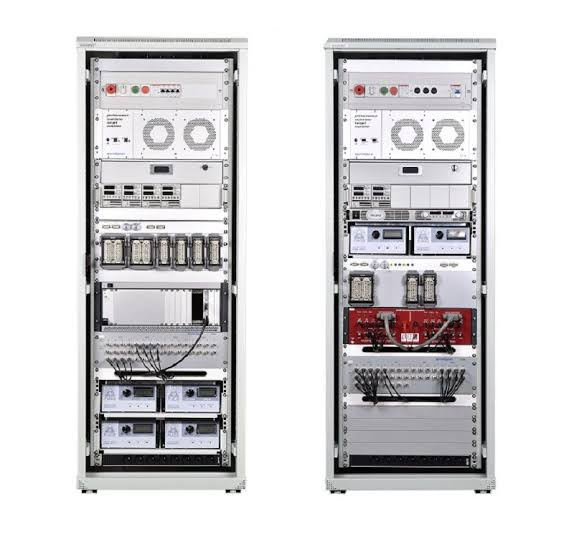
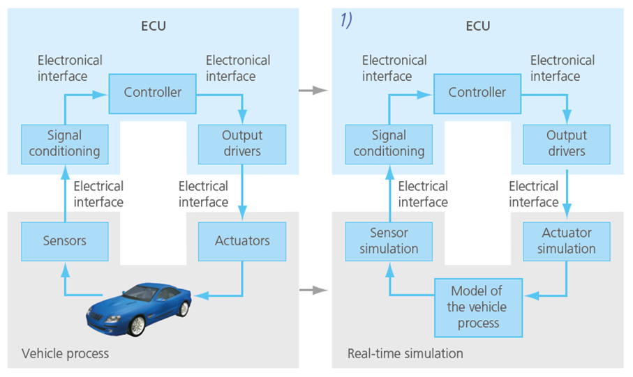
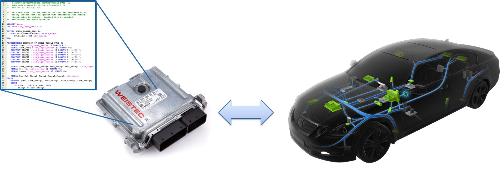
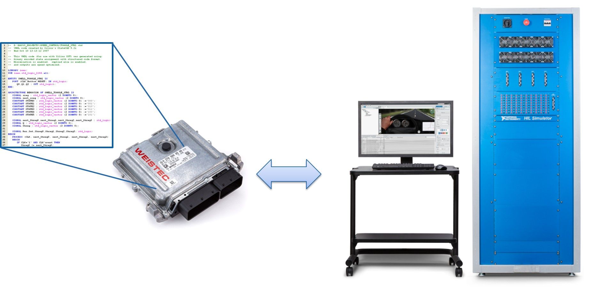
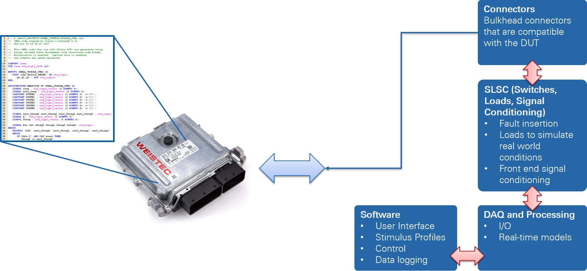
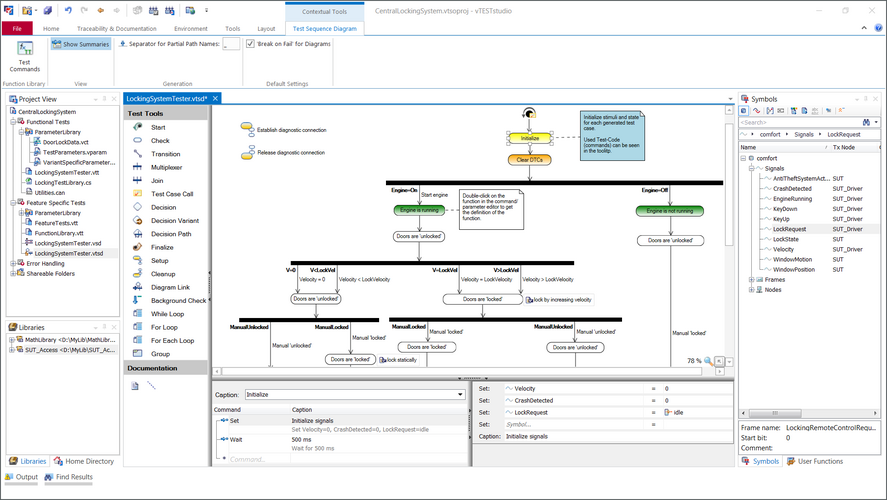
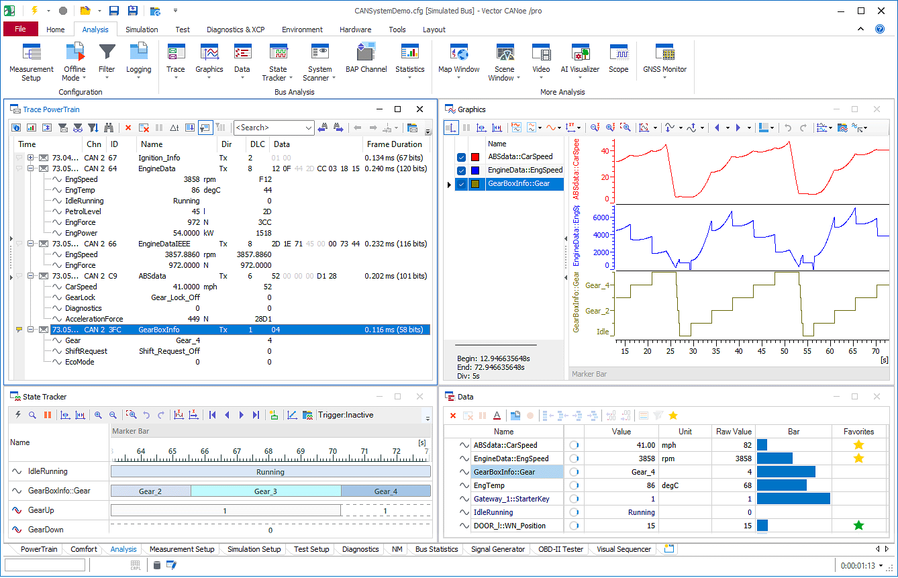
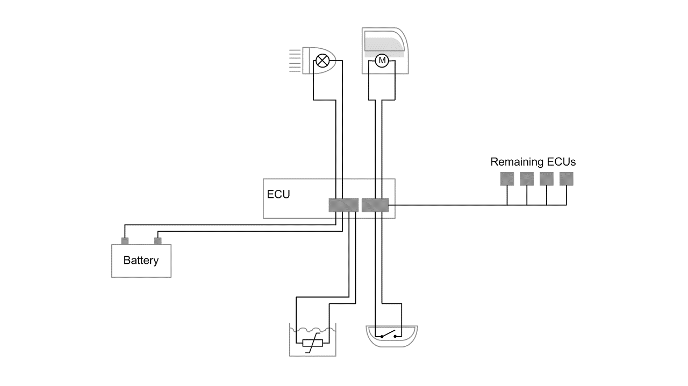
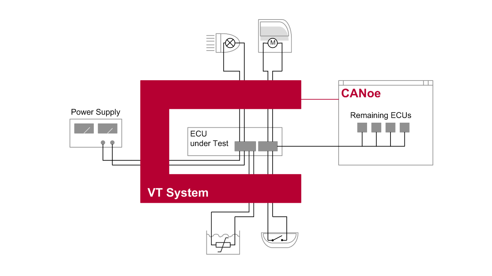
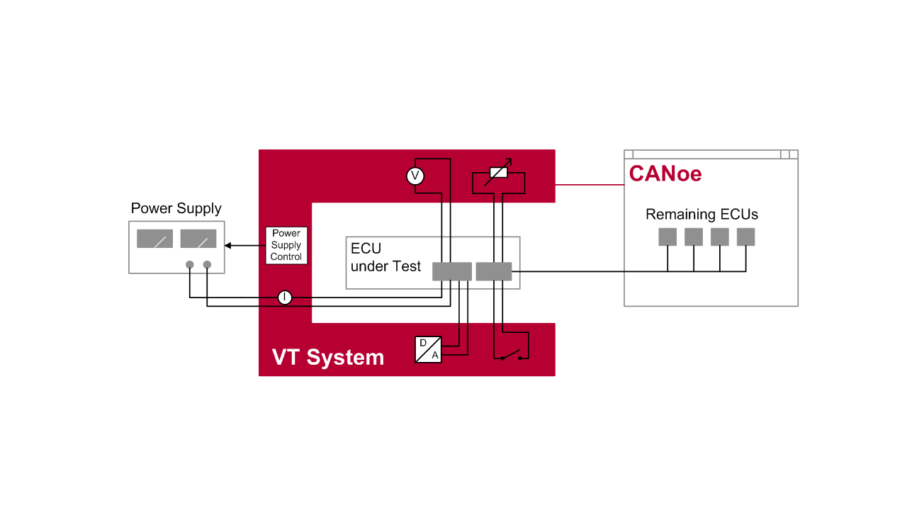

#KPIT #Assignment 

# Engineering 9 Introduction

## List of Topics

- **[[#V-Model (Integration Test)]]**
	- [[#What is V-Model?]]
	- [[#V-Model Verification vs Validation]]
	- [[#V-Model What is Integration Testing?]]
- **[[#HIL (Hardware-In-Loop)]]**
	- [[#Engine Testing vs HIL]]
	- [[#HIL Process]]
- **[[#VT System]]**
	- [[#what is VT System?]]
	- [[#VT System Concept]].
---

## V-Model (Integration Test) 
### What is V-Model?
The V-Model is a Software development process that describes the relationship between each phase of the development life cycle and its corresponding testing phase. Our expert explains the `inputs` and `outputs` of this methodology

V-Model Life Cycle

### V-Model: Verification vs Validation
**Verification:** It involves a static analysis method(review) ==done without executing code.== It is the process of evaluation of the product development process to find whether specified requirements meet.

**Validation:** It involves dynamic analysis method(functional, non-functional), ==testing is done by executing code== Validation is the process to classify the software after the completion of the development process to determine whether the software meets the customer expectations and requirements.  

### V-Model: What is Integration Testing?
**Integration Testing** is ==integration Test Plans are develop during the software Design Phase== These test verify that groups created tested independent can coexist and communicate among themselves.

---
## HIL (Hardware-In-Loop)

**HIL Testing (Hardware-In-Loop)** is a technique where real signal from a controller are connected to a test system that simulates reality, tricking the controller into thinking it is in assembled product. Test and design iteration take place as though the real-world system is being used. You can easily run through thousands of possible scenarios to property exercise your controller without  the cost and time associated with actual physical tests.

## Engine Testing vs HIL

**Engine Testing:** The engine ECU is responsible for converting sensor measurements into action such as adjusting air intake when the accelerator is pressed.

**HIL(Hardware-In-Loop):** An HIL test replace the engine with simulation comprising hardware and software that interacts with real I/O as though the physical engine were present. Because updates can be made in software.

### HIL Process

---
## VT System

### what is  VT System?

VT System is industry wide recognized tool that powers the automation of Hardware-In-Loop (HIL) Testing of automation control units. Our Functional Testing team has extensive expertise in performing HIL Testing using VT System along with `Vtest Studio` and `Vector CANoe`.

Vtest Studio

Vector CANoe 
 

### VT System Concept
When performing function testing the ECU has to be tested in an environment in which it can see no difference between the real vehicle environment and the testing environment.

The I/O line of the ECU are connected to the modular **<u>VT System</u>** and when necessary original sensor and actuators too. The PC with the **<u>CANoe</u>** is connected via a fast, Ethernet-based real-time network port. This makes it easy to build flexible test systems with little integration or wiring effort.

**1. ECU environment in the vehicle**

**2. Testing with original loads and sensors**

**3. Testing with simulated actuators and sensors**

